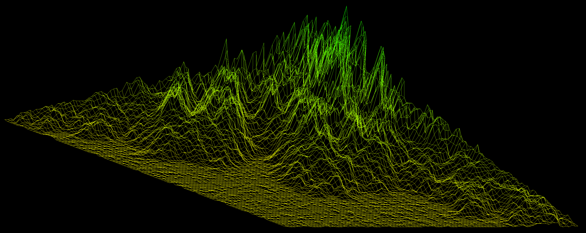

# fdf by astein
[-> key commands](resources/help_on_screen.txt)
<br />
### loading a map
```
./fdf ./maps/nice_maps/t2.fdf
```

<br />
### creating a map
```
./fdf astein
```


note: following symbols have a map in ```./maps/letters/```:

```./fdf 'abc...xyz'```


```./fdf 'ABC...XYZ'```


```./fdf '01...89'```


```./fdf '?! _-.'```


some of the maps in ```./maps/nice_maps/``` are from [@duarte3333](https://github.com/duarte3333/FdF_Wireframe_model/tree/main/Maps) thx!
<br />
## useful links
[-> creating maps](https://patorjk.com/software/taag/#p=display&h=0&f=Doh&t=astein)<br />
[-> minilibx](https://harm-smits.github.io/42docs/libs/minilibx/getting_started.html)<br />
[-> minilibx images](https://aurelienbrabant.fr/blog/pixel-drawing-with-the-minilibx)<br />
[-> drawing lines](https://en.wikipedia.org/wiki/Bresenham%27s_line_algorithm)<br />
[-> rotating](https://en.wikipedia.org/wiki/Rotation_matrix)<br />
